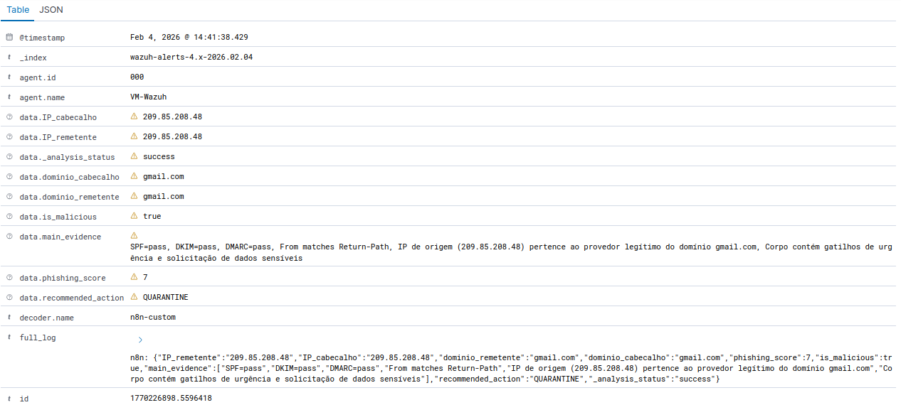
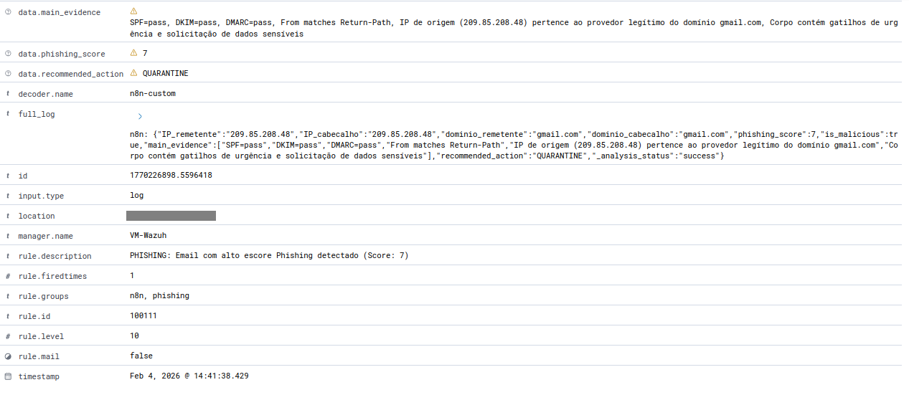
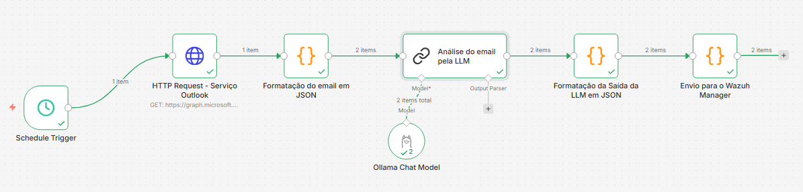
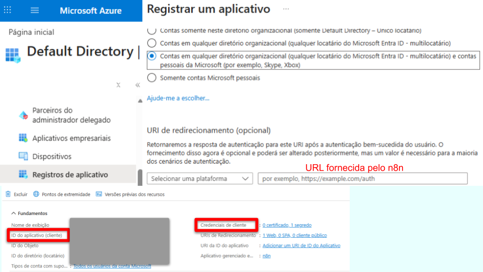
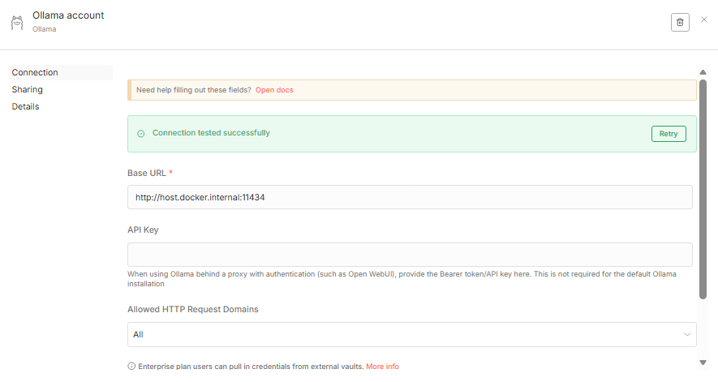

# **Pipeline de Defesa Anti-Phishing | AI-Powered**

## **📋 Sobre o Projeto**
Este projeto consiste em um pipeline automatizado de Detecção e Resposta a Ameaças (TDR) focado em Phishing. A solução integra automação de fluxo de trabalho (n8n), análise cognitiva via Inteligência Artificial Local (Ollama) e monitoramento de segurança (Wazuh SIEM).

O objetivo é reduzir a fadiga de alertas dos analistas de SOC, automatizando a triagem inicial de e-mails suspeitos e gerando alertas qualificados com contexto rico para tomada de decisão.




---

## **🏗️ Arquitetura da Solução**
O fluxo de dados segue a seguinte lógica:
* **Ingestão:** O n8n monitora a caixa de entrada via API (no caso, email outlook, pelo `Microsoft Graph`) em busca de novos e-mails.
* **Análise Cognitiva:** O conteúdo do e-mail (corpo e cabeçalhos) é enviado para um LLM local (utilizando `Ollama`), sendo o modelo `Llama 3.1:8b` escolhida para esse projeto, que analisa:
  * Intenção do remetente (Urgência, Autoridade, Ameaça).
  * Análise técnica de cabeçalhos (SPF, DKIM, DMARC, Return-Path).
  * Atribuição de um `Phishing Score` (0-10).
* **Normalização:** Os dados são estruturados em JSON limpo e enviados via Syslog/Socket.
* **Detecção (SIEM):** O Wazuh recebe o log, aplica Decoders customizados (JSON) e Regras de correlação.
<br>

O documento JSON de setup do workflow, pode ser acessado em [phishing-mail-n8n-wazuh.json](./phishing-mail-n8n-wazuh.json)

---

## **🚀 Tecnologias Utilizadas**
* **Orquestração:** `n8n` (Workflow Automation), `Docker`
* **LLM:** `Ollama`, `Llama 3.1:8b`
* **SIEM:** `Wazuh`
* **Fonte de Dados:** `Microsoft Graph API` (`Outlook`/`Exchange`)
* **Protocolos:** `JSON`, `Syslog`, `HTTP Requests`, `UDP`

## **⚙️ Configurações e Implementação**

Para implementação inicialmente clone o repositório:
```bash
git clone
cd 
```

### 1. Workflow n8n
O fluxo no n8n é responsável por buscar, sanitizar e enviar os dados para a IA.
* **Loop Control:** Implementado controle de concorrência (Split in Batches) para respeitar o limite de processamento do LLM local.
* **Prompt Engineering:** Prompt otimizado para retornar reposta JSON estruturada, evitando alucinações.
* **Formatação:** Realizada a formatação do JSON obtido pela reposta da LLM para envio ao Wazuh.

[Implementaçao Completa no `n8n`](#implementação-n8n)
<br>

### 2. Wazuh Manager
* **Decoders (`local_decoder.xml`):** Utilização do plugin nativo `JSON_Decoder` com tratamento de `offset` para leitura eficiente de logs estruturados.
* **Rules (`local_rules.xml`):** Hierarquia de regras para classificar a severidade baseada no phishing_score gerado pela IA.
  * **Rule 100110 (Level 3):** Log informativo de análise.
  * **Rule 100111 (Level 10):** Alerta Crítico para phishing.

[Implementação Completa no `Wazuh Manager`](#implementação-wazuh-manager)

---

## ⛓️ **Implementação n8n**

A implementação no n8n, seguiu os seguintes passos:
* [Criação do container pelo Docker](#1-criação-do-container-pelo-docker)
* [Criação e configuração de nós](#2-criação-e-configuração-de-nós)

## 1. Criação do container pelo Docker

A criação do container pelo `Docker`, é feita utilizando o `docker-compose.yml` presente nesse repositório que já está configurado:
*  Adição da biblioteca `node.js` utilizada em códigos do workflow. 
*  Endpoint para acesso `localhost` de outros serviços pelo `n8n`.
*  Acesso ao `n8n` pela em `localhost` pela porta padrão `5678`.

Para isso, dentro do diretório monte o volume com as configurações e imagem do n8n:

```bash
docker compose up -d
```

Após finalizar a monatagem, o serviço do `n8n` ficará acessível pelo `localhost://5678`.
Serão solicitados dados iniciais de autenticação, que será solicitado para posterior acesso.

## 2. Criação e configuração de nós

A criação de nós foi estruturada em 6 nós, da seguinte forma:
- [**Pipeline de Defesa Anti-Phishing | AI-Powered**](#pipeline-de-defesa-anti-phishing--ai-powered)
  - [**📋 Sobre o Projeto**](#-sobre-o-projeto)
  - [**🏗️ Arquitetura da Solução**](#️-arquitetura-da-solução)
  - [**🚀 Tecnologias Utilizadas**](#-tecnologias-utilizadas)
  - [**⚙️ Configurações e Implementação**](#️-configurações-e-implementação)
    - [1. Workflow n8n](#1-workflow-n8n)
    - [2. Wazuh Manager](#2-wazuh-manager)
  - [⛓️ **Implementação n8n**](#️-implementação-n8n)
  - [1. Criação do container pelo Docker](#1-criação-do-container-pelo-docker)
  - [2. Criação e configuração de nós](#2-criação-e-configuração-de-nós)
    - [2.1. Nó de disparo do workflow](#21-nó-de-disparo-do-workflow)
    - [2.2. Nó de `HTTP Request` para acesso e obtenção dos emails](#22-nó-de-http-request-para-acesso-e-obtenção-dos-emails)
    - [2.3. Nó de formatação dos dados obtidos pelo email em JSON](#23-nó-de-formatação-dos-dados-obtidos-pelo-email-em-json)
    - [2.4. Nó de análise dos dados do email pela LLM](#24-nó-de-análise-dos-dados-do-email-pela-llm)
    - [2.5. Nó de formataçao da saída da LLM em JSON](#25-nó-de-formataçao-da-saída-da-llm-em-json)
    - [2.6. Nó de envio dos dados para Wazuh Manager](#26-nó-de-envio-dos-dados-para-wazuh-manager)
  - [📊 **Implementação Wazuh Manager**](#-implementação-wazuh-manager)
    - [1. Configuração de syslog por UDP](#1-configuração-de-syslog-por-udp)
    - [2. Configuração de decoders](#2-configuração-de-decoders)
    - [3. Configuração de rules](#3-configuração-de-rules)
  - [🤝 Contribuições e Melhorias](#-contribuições-e-melhorias)



### 2.1. Nó de disparo do workflow
No nó de disparo, foi setado tempo fixo para disparo da execução do worflow à cada 5 minutos.
<br>


### 2.2. Nó de `HTTP Request` para acesso e obtenção dos emails
O nó de acesso acesso e obtenção de amail, foi configurado para obter email do `outlook`, recebidos nos últimos 5,5, obtendo os dados do email com seu cabeçalho e corpo. 

**Criação de Credencial (Outlook)**
Para esse nó , no caso, foi utilizado o acesso à uma conta `outlook`, assim seguindo:
* Criação uma credencial do tipo `Microsoft Oauth2 API` no `n8n`

* Obtidos os `Client ID` e o `Client Secret` da conta, pelo `Entra ID` na `Azure`, no **Registro de Aplicativo**, utilizando o `OAuth Redirect URL` forencido pelo `n8n`.
<br>



**Configuração do nó**
Para a criação e configuração do nó:
* Criado um nó do tipo `HTTP Request`
* Método `GET`
* URL `https://graph.microsoft.com/v1.0/me/messages` (Endpoint do `Microsoft Graph API` para email)
* Autenticação do tipo `Predefined Credential Type` -> `Microsoft Oauth2 API` -> Selecionar a credencial criada anteriormente.
* Parâmetros da Query 1
  * Name: `$filter`
  * Value: `receivedDateTime ge {{ $now.minus({ minutes: 5, seconds: 30 }).toISO() }}` 
* * Parâmetros da Query 1
  * Name: `$expand`
  * Value: `singleValueExtendedProperties($filter=id eq 'String 0x007D')` 

### 2.3. Nó de formatação dos dados obtidos pelo email em JSON
Esse nó, filtra os principais dados obtidos, para inclusão do JSON formatado, e posterior análise pela LLM.
Para a criação e configuração do nó:
* Criado um nó do tipo `Code` -> `Javascript`
* Mode: `Run Once for All Items`
* Language: `Javascript`
* Script:
```js
// Verifica se a API retornou dados
const response = $input.first().json;
if (!response.value || !Array.isArray(response.value)) {
  return []; 
}

// Mapeia a lista para itens individuais
return response.value.map(email => {
  // Extrai o header 
  const rawHeaders = $input.first().json.value[0].singleValueExtendedProperties[0].value;
  
  return {
    json: {
      assunto: email.subject,
      de: email.from?.emailAddress?.address,
      data: email.receivedDateTime,
      // Usa 'email' em vez de buscar no input global fixo
      anexos: email.hasAttachments, 
      headers: rawHeaders, 
      corpo: email.body?.content || email.bodyPreview || "Sem corpo"
    }
  };
});
```

### 2.4. Nó de análise dos dados do email pela LLM
Nó de análise dos dados do email pela LLM, foi utilizado prompt para guiar os pontos imposrtantes de análise e geração do JSON com os dados estruturados do resultado da análise da LLM.
Dentro do nó, foi segmentado um sub nó, para envio ao servidor `Ollama` local, e para seu acesso pelo `n8n`, foi necessária a criação de uma credencial.

**Criação de Credencial (Ollama)**
* Criação de credential do tipo `Ollama`
* Em Base URL, utilizar o endpoint de acesso ao localhost, setado pelo `Docker-compose.yml`, na porta `11434`, padrão do  serviço `Ollama` -> `http://host.docker.internal:11434` (Quando serviço `Ollama` rodando em modo local)
* Outras formas de integração ao `n8n`, podem ser consultadas pela documentação do `Ollama`: https://docs.ollama.com/integrations/n8n#n8n

<br>

**Configuração do nó**
* Criado um nó do tipo `Basic LLM Chain`
* Source for Prompt (User Message): `Define below`
* Prompt: [prompt.md](./tools/prompt.md)

**Configuração do sub nó**
* Criado um sub nó do tipo `Ollama Chat Model`
* Credential to connect with: `Ollama Account` (Credencial criada em `Credentials`)
* Model: `llama3.1:8b` (Recomendada, ou qualquer outra de preferência)
* Output Format: `Default`

**Configuração básica Ollama**
* Realizar Download -> https://ollama.com/download
* Fazer pull do modelo desejado, no caso desse projeto `Llama3.1:8b` -> `ollama pull llama3.1:8b`
* Iniciar serviço local -> `ollama start`
* Iniciar servidor para acesso local -> `ollama serve`

### 2.5. Nó de formataçao da saída da LLM em JSON
Nesse nó, é realizada a normalização dos dados obtidos pela resposta da LLM, realizando por regex, a separação do JSON criado por ela, e formatação para passagem ao Wazuh.
Nele também, foi definido o termo que identifica o 

**Configuração do nó**
* Criado um nó do tipo `Code` -> `Javascript`
* Mode: `Run Once for All Items`
* Language: `Javascript`
* Script: 

```js
return $input.all().map(item => {
  
  // 1. Captura a resposta bruta
  const rawText = item.json.response?.generations?.[0]?.[0]?.text || item.json.text || "";

  let targetText = rawText;

  // 2. Regra da IA de indicar o início do JSON, através do termo "OBJETO JSON->", seleção do contepudo que vem após ele
  if (rawText.includes("OBJETO JSON->")) {
    const parts = rawText.split("OBJETO JSON->");
    targetText = parts[parts.length - 1]; // Pega sempre o último pedaço
  }

  // 3. Agora procuramos o JSON apenas nesse pedaço final limpo
  const jsonMatch = targetText.match(/\{[\s\S]*\}/);

  let outputData = {};

  if (jsonMatch) {
    try {
      const cleanJsonString = jsonMatch[0];
      const parsedData = JSON.parse(cleanJsonString);

      outputData = {
        ...parsedData,
        _analysis_status: "success"
      };
    } catch (error) {
      outputData = {
        error: "Estrutura JSON inválida (Parse Error)",
        raw_fragment: targetText, // Ajuda a debugar vendo o que sobrou
        _analysis_status: "error"
      };
    }
  } else {
    outputData = {
      error: "Nenhum bloco JSON encontrado após o marcador",
      raw_output: rawText,
      _analysis_status: "empty"
    };
  }

  return {
    json: outputData
  };
});
```

### 2.6. Nó de envio dos dados para Wazuh Manager
Nó para realização do envio do JSON obtido pelo nó anterior, através de protocolo `UDP` pelo módulo `dgram`, por `syslog`, para o IP de onde está o servido com o `Wazuh Manager` e porta padrão `514` para recepção de logs externos.
Nesse nó, também ocorre há a indicação do início do objeto JSON (log), pelo termo `n8n: `, para posterior uso em decoders no `Wazuh Manager`.

**Configuração do nó**
* Criado um nó do tipo `Code` -> `Javascript`
* Mode: `Run Once for All Items`
* Language: `Javascript`
* Script: 

```js
const dgram = require('dgram');

const items = $input.all();
const client = dgram.createSocket('udp4');

// CONFIGURAÇÕES
const WAZUH_IP = <IP DO SERVIDOR WAZUH MANAGER>; 
const WAZUH_PORT = 514;

items.forEach(item => {
  // 1. Gera o JSON limpo
  const jsonContent = JSON.stringify(item.json);
  
  // 2. Cria o Header Syslog (PRI + Tag)
  // <13> = Facility User (1) + Severity Notice (5)
  // Adicionamos "n8n:" para o Wazuh saber quem enviou
  const syslogMessage = `<13>n8n: ${jsonContent}`;
  
  const message = Buffer.from(syslogMessage);
  
  client.send(message, WAZUH_PORT, WAZUH_IP, (err) => {
    if (err) console.error('Erro UDP:', err);
  });
});

// Fecha a conexão
setTimeout(() => {
  client.close();
}, 1000);

return items;
```

---

## 📊 **Implementação Wazuh Manager**

A implementação no Wazuh Manager, seguiu os seguintes passos:
* [Configuração de syslog por UDP](#1-configuração-de-syslog-por-udp)
* [Configuração de decoders](#2-configuração-de-decoders)
* [Configuração de rules](#3-configuração-de-rules)

### 1. Configuração de syslog por UDP
A configuração para permição de coleta de logs via `syslog` por pela porta `514` via protocolo `UDP`, foi feita pelo documento de configuração do `Wazuh Manager` -> `sudo nano /var/ossec/etc/ossec.conf`.

```xml
  <remote>
    <connection>syslog</connection>
    <port>514</port>
    <protocol>udp</protocol>
    <allowed-ips><IP DO SERVIDOR n8n></allowed-ips>
  </remote>
```

### 2. Configuração de decoders
A configuração do decoder para o log recebido do n8n, deve iniciar a captura dos dados, à partir do termo que identifica o início do log gerado pelo `n8n`, definido como `n8n: ` no último nó, de envio do JSON ao Wazuh, e utilizando plugin `JSON_decoder`, extrai os campos do JSON do log, e fornece os dados para o registro de eventos e alerta.
A configuração foi realizada no documento de decoders -> `sudo nano /var/ossec/etc/decoders/local_decoder.xml`

```xml
<decoder name="n8n-custom">
    <prematch>^n8n: </prematch>
    <plugin_decoder offset="after_prematch">JSON_Decoder</plugin_decoder>
</decoder>
```

### 3. Configuração de rules
Na configuração da regra para o n8n, realiza a criação de um grupo para a feramenta `n8n` e o seu objetivo de análise `phishing`, utilizando o decoder criado `n8n-custom` para sua identificação e define alerta quando o `phishing_escore` obtido pelo log foi maior que 5.
A configuração foi realizada no documento de decoders -> `sudo nano /var/ossec/etc/rules/local_rules.xml`

```xml
<group name="n8n,phishing,">

  <rule id="100110" level="3">
    <decoded_as>n8n-custom</decoded_as>
    <description>n8n: Análise de escore phishing de email</description>
  </rule>

  <rule id="100111" level="10">
    <if_sid>100110</if_sid>
    <field name="phishing_score" type="pcre2">^([6-9]|10)$</field>
    <description>PHISHING: Email com alto escore Phishing detectado (Score: $(phishing_score))</description>
  </rule>

</group>
```

--- 

## 🤝 Contribuições e Melhorias

Este projeto foi desenvolvido como parte de um estudo prático em Engenharia de Detecção e Automação. Como a tecnologia e os vetores de ataque evoluem rapidamente, este repositório está aberto a sugestões!

Se você tiver ideias para:
* Otimizar o **Prompt do Sistema** para reduzir alucinações.
* Criar novas **Regras de Correlação** no Wazuh.
* Melhorar a eficiência do fluxo no **n8n**.

Sinta-se à vontade para **abrir uma Issue** relatando a sugestão ou enviar um **Pull Request** com melhorias no código. Todo feedback é bem-vindo para tornar a detecção mais robusta.


